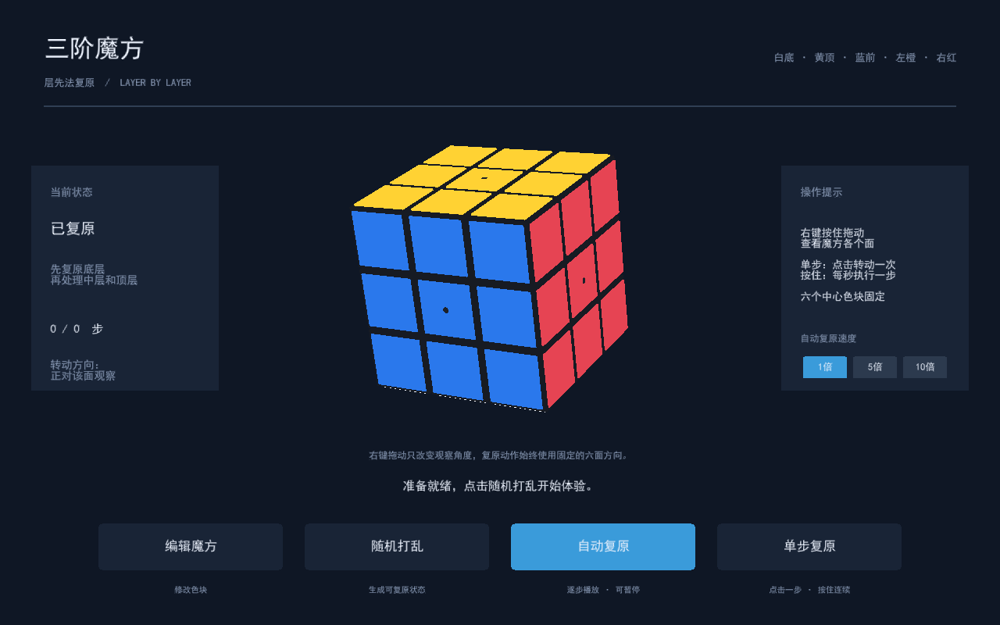
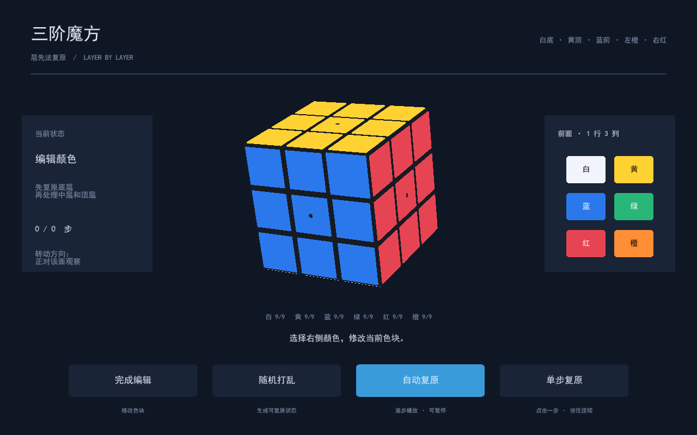

**Rubik Visual · 三阶魔方可视化层先法复原**

一个面向 Python 初学者的 Windows 桌面项目：在三维界面录入魔方颜色、随机打乱，并观看层先法逐步复原。自写 Python 代码逐行注释，适合学习状态建模、三维坐标、动画控制和软件分层。



**功能与约定**

| 功能 | 操作与行为 |
| --- | --- |
| 完整三维魔方 | 绘制 26 个可见小方块和 54 个色块，按住右键拖动观察 |
| 编辑魔方 | 左键选非中心色块，再选择颜色；六个中心固定 |
| 随机打乱 | 从复原状态执行 25 个合法随机动作，保证可复原 |
| 自动复原 | 根据当前颜色计算七阶段层先法，支持暂停、继续及 1 / 5 / 10 倍速度 |
| 单步复原 | 点击转动一次 90°，按住以每秒一步连续执行，松开停止后续动作 |
| 输入检查 | 检查颜色数量、块的组合、翻棱、扭角和交换奇偶性 |

初始参考朝向固定为 **白底、黄顶、蓝前、绿后、左橙、右红**。中心上的黑色小点表示不可编辑。拖动只改变视角，不改变内部状态；上下、左右拖动方向均采用反转设置。

**运行条件**

- 首个正式支持平台：Windows，已在作者的 Windows 设备上验收。Linux / macOS 的图形界面尚未验收。
- 推荐 conda 环境，Python 3.12；本地验收版本为 Python 3.12.15。
- 主要依赖：Ursina 8.3.0、magiccube 1.2.0；完整验收版本在 [requirements-lock.txt](requirements-lock.txt)。
- 需要能创建 OpenGL 图形上下文的显卡与驱动。
- 默认使用已有的 `C:\Windows\Fonts\simhei.ttf` 中文字体；仓库不分发 Windows 系统字体。

**下载与创建环境**

以下命令在 Windows 的 Anaconda Prompt 或已初始化 conda 的 CMD 中运行。已有项目时，直接进入项目目录，不必再次下载。

```bat
rem 下载仓库；仓库发布后该地址可用。
git clone https://github.com/Fanfzy/rubik-visual.git
rem 进入包含 environment.yml 的项目目录。
cd rubik-visual
rem 将环境放在 D 盘；其他使用者可以把路径改成自己的位置。
conda env create --prefix D:\conda_envs\rubik_visual --file environment.yml
rem 激活刚创建的环境。
conda activate D:\conda_envs\rubik_visual
rem 确认当前 Python 所在位置。
python -s -c "import sys; print(sys.executable)"
rem 检查已安装依赖之间的版本关系。
python -s -m pip check
```

没有 D 盘时，可改成自己选择的完整路径，也可用 `conda env create --file environment.yml` 创建名为 `rubik_visual` 的环境，再运行 `conda activate rubik_visual`。环境文件没有绑定作者电脑的绝对位置。

`environment.yml` 用 conda 安装 Python 和 pip，并在该环境内用 pip 安装固定版本依赖。`requirements.txt` 仅列直接依赖；首次复现推荐使用环境文件及完整锁定文件。`PYTHONNOUSERSITE=1` 和启动参数 `-s` 用于隔离用户级 Python 包，避免其他项目的包影响本项目。

**首次运行：先测试，再打开界面**

```bat
rem 核心测试无需创建三维窗口，适合先检查模型、算法和启动器。
python -s run_tests.py --core
rem 完整验收还会创建真实离屏 OpenGL 缓冲并保存截图。
python -s run_tests.py
rem 验收后启动桌面界面。
python -s main.py
```

默认核心验收包含 1000 个固定种子的随机打乱，以及层先法阶段里程碑检查。完整模式还测试真实三维实体、射线选色、引擎鼠标事件和速度切换。离屏测试不能代替实际手动使用体验。

也可双击 `启动魔方.cmd` 或 `运行测试.cmd`。两个入口共用解释器选择规则：**`RUBIK_PYTHON` 显式设置 → 已激活的 conda 环境 → 作者默认路径 `D:\conda_envs\rubik_visual`**。环境位于其他路径时，从激活环境的终端执行启动脚本，或者先在 CMD 设置：

```bat
rem 指定已有环境中的解释器；不要在变量值内部加引号。
set "RUBIK_PYTHON=E:\my_envs\rubik_visual\python.exe"
rem 使用上面指定的解释器启动。
call 启动魔方.cmd
```

这些脚本只选择已有解释器，不会自动创建环境或安装依赖。测试失败时返回非零退出码。

**四个按钮怎么用**

1. **编辑魔方**：进入编辑模式，左键点击色块，在右侧选色。右键拖动查看背面和底面。完成后点“完成编辑”；非法状态会保留编辑模式并提示原因。
2. **随机打乱**：重新生成合法状态，并清除旧的解法。它也能帮助你从错误涂色恢复到可复原状态。
3. **自动复原**：后台根据当前色块计算解法，再播放动画。可切换速度、暂停或继续；暂停时当前动作先完整结束。
4. **单步复原**：单击执行一个动作，按住连续执行。在任意位置松开都停止后续动作。自动暂停后也能接着单步执行。



Esc 取消当前色块选择，窗口右上角关闭按钮退出。动画中禁止编辑和打乱，防止模型与半完成的画面不一致。

| 自动速度 | 每步动画 | 两步之间等待 | 相邻动作开始的间隔 |
| --- | --- | --- | --- |
| 1 倍 | 0.30 秒 | 0.70 秒 | 1.00 秒 |
| 5 倍 | 0.06 秒 | 0.14 秒 | 0.20 秒 |
| 10 倍 | 0.03 秒 | 0.07 秒 | 0.10 秒 |

以上是播放器目标时间，实际显示流畅度受帧率影响。切换档位时正在转动的一步保持原来的速度，后续自动动作使用新档位。单步点击与长按保持一倍，不受自动速度影响。

**复原方法与动作记号**

七个教学阶段依次为：白色底面十字 → 白色底层角块 → 中间层棱块 → 黄色顶面十字 → 顶层棱块归位 → 顶层角块归位 → 顶层角块转向。

底面十字既要白色朝下，也要棱块侧面的颜色与中心相同。后续阶段的公式需要保持已经完成的部分。程序采用 magiccube 的初学者层先法，并保留阶段标签；目标是展示过程，不追求最少步数。

| 记号 | 初始参考朝向中的面 |
| --- | --- |
| U / D | 顶面 / 底面 |
| F / B | 前面 / 后面 |
| L / R | 左面 / 右面 |

判断顺时针时，要想象自己正对该面。`R` 表示右面顺时针 90°，`R'` 表示右面逆时针 90°，`R2` 表示 180°，播放时拆成两步。视角拖动后，这些记号仍指初始参考系中的面。

求解读取当前 54 个颜色，**不靠倒放打乱历史**。算法内部的整块参考旋转会被转换成固定朝向的单面动作，因此不会强行转动你的观察视角。

**为什么颜色数量正确也可能无法复原**

每种颜色有 9 块只是第一项要求。例如蓝绿是相对面，不可能组成同一条棱。真实魔方还必须包含 8 个不同的角块和 12 个不同的棱块，并满足整体约束。

单独翻转一条棱、单独扭转一个角、或者只交换两条棱，都无法靠正常面转动复原。程序会检查这些情况，帮助你修正录入；不会把错误状态交给求解器反复尝试。

**项目结构与学习顺序**

| 文件 | 责任 |
| --- | --- |
| `main.py` | 字体、窗口和程序入口 |
| `rubik/model.py` | 54 色块状态、固定配色、编辑与合法转动 |
| `rubik/geometry.py` | 贴片坐标、法向量和 90° 几何变换 |
| `rubik/validation.py` | 输入格式与物理可复原性检查 |
| `rubik/solver.py` | 第三方层先法适配、阶段记录与输出重放校验 |
| `rubik/playback.py` | 动作队列、计时、暂停、长按与速度控制 |
| `rubik/view.py` | 小方块、贴片、碰撞选取和转动动画 |
| `rubik/ui.py` | 按钮、编辑流程和后台求解任务协调 |
| `tests/` | 模型、求解、播放、启动脚本及图形验收 |
| `scripts/find_python.cmd` | 两个启动入口共用的环境定位器 |
| `docs/` | 学习文档、发布指南与展示截图 |
| `third_party_licenses/` | 主要第三方组件的原始许可声明 |

建议先读 `model.py`，再读 `validation.py`、`solver.py`、`playback.py`，最后看 `geometry.py`、`view.py`、`ui.py` 和入口。详细例子见 [架构与原理说明](docs/architecture.md)。代码按逻辑分区逐行注释，不在每行之间插入空行。

**常见问题**

- **提示找不到 Python**：先激活正确的 conda 环境，或设置 `RUBIK_PYTHON`。路径不存在时脚本不会回退到其他 Python。
- **提示找不到 ursina / magiccube**：先查看 `sys.executable`，确认使用项目环境，再按环境文件安装。不要把依赖装进 base 来掩盖路径问题。
- **中文字体不存在**：设置 `RUBIK_FONT` 指向自己已有的、包含中文字符的 `.ttf` 字体；不要把没有再分发许可的字体提交到仓库。
- **图形测试失败或无法打开窗口**：检查显卡驱动、OpenGL 和当前会话的图形支持。`--core` 通过仅说明核心测试通过，不代表图形部分通过。
- **双击 .cmd 出现半截英文被当作命令**：检查文件是否保持 ASCII 内容和 CRLF 换行。仓库的 `.gitattributes` 与测试会检查这一约定。
- **复原步数较多**：这是初学者层先法的正常特点，项目没有最短步数模式。

```bat
rem 使用已有中文字体；这个示例需替换为实际存在的路径。
set "RUBIK_FONT=E:\fonts\ChineseFont.ttf"
rem 激活项目环境后正常启动。
python -s main.py
```

测试产物保存在忽略提交的 `test_outputs/`：完整报告为 `test_report.txt`，核心报告为 `core_report.txt`。README 图片单独保存在 `docs/images/`，不依赖本机临时文件。

普通桌面窗口还有一个独立的短时启动验收，会打开窗口、检查真实指针接口并自动关闭：

```bat
rem 使用正式启动器检查普通桌面窗口，与离屏图形测试互为补充。
call 启动魔方.cmd --test-window
```

**参与改进与发布**

问题反馈和代码贡献见 [CONTRIBUTING.md](CONTRIBUTING.md)。项目作者的首次上传及版本发布步骤见 [GitHub 配置指南](docs/github-guide.md)。仓库发布后，Issues 可用于提交可复现问题。

GitHub Actions 配置会在 Windows 上检查锁定依赖、逐行注释、文档链接、核心算法及启动脚本；真实 OpenGL 图形验收保留为本地发布前检查。工作流文件存在不表示云端已经验收成功，首次上传后请查看 Actions 的实际结果。

**许可与来源**

本项目自写代码采用 [MIT 许可证](LICENSE)，署名 **Fanfzy**。允许使用、修改和分发，包括商业使用；需保留版权和许可声明。以 LICENSE 原文为准。

| 组件 | 用途 | 许可 |
| --- | --- | --- |
| [Ursina](https://github.com/pokepetter/ursina) | 三维显示、界面与鼠标输入 | [MIT](third_party_licenses/ursina-MIT.txt) |
| [magiccube](https://github.com/trincaog/magiccube) | 魔方模型和初学者层先法 | [BSD-3-Clause](third_party_licenses/magiccube-BSD-3-Clause.txt) |

本项目通过独立适配模块使用第三方接口，没有修改安装目录中的第三方源码。项目 MIT 许可不会替代依赖各自的许可证。更多来源说明见 [THIRD_PARTY_NOTICES.md](THIRD_PARTY_NOTICES.md)。
